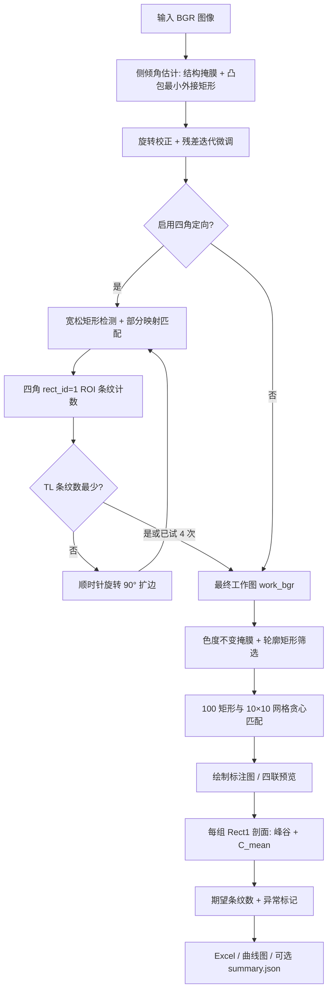

# MRC 靶标图像处理算法 — 项目手册（算法说明）

| 项目 | 内容 |
|------|------|
| 文档名称 | MRC 算法项目手册 |
| 算法实现主文件 | `mrc/MRC_progress/MRC_final.py`（类 `MRCFinalProcessor`） |
| 关联脚本 | `MRC_GBA1.py`（矩形检测与映射流程拆分演示）、`MRC_bofeng.py`（条纹剖面/C 值思路来源）、`ocr.py` / `Readme.txt`（旋转摆正思路说明） |
| 上位机集成副本 | `ImageCaptureApp/Python/MRC_final.py`（与进度版算法一致，并增加 `*_summary.json` 供 C# 读取） |
| 文档版本 | 1.0 |
| 发布日期 | 2026-05-08 |

---

## 修订记录

| 版本 | 日期 | 说明 |
|------|------|------|
| 1.0 | 2026-05-08 | 依据 `mrc/MRC_progress/MRC_final.py` 梳理全流程与公式，注明与上位机副本差异 |

---

## 1. 引言

### 1.1 编写目的

本手册描述 **GBA1 靶标类 MRC 图像**在软件中的自动处理链路：如何将倾斜图像几何摆正、如何消除 90° 朝向歧义、如何在整图中检出 **100 个矩形单元**并与 **10×10 映射表**一一对应编号、如何在每组 **第 1 号矩形**上提取条纹剖面并计算 **对比指标 C_mean**、如何依据期望条纹数标记异常并（在上位机版本中）汇总 **最小可分辨组**结论。

### 1.2 适用范围

- 适用于阅读与维护 `MRC_progress` 目录内 Python 算法及与 `ImageCaptureApp` 集成的 `Python/MRC_final.py`。
- 不替代光学/靶标物理定义文档；文中 **group_id、条纹期望表、阈值 0.03** 等均来自当前代码默认值，现场可按工艺更改参数。

### 1.3 术语与符号

| 术语 | 含义 |
|------|------|
| 摆正 / 对齐（Aligned） | 消除相机相对靶标平面的小角度旋转，使靶标行列近似水平垂直 |
| 四角定向（Corner orientation） | 在 0°/90°/180°/270° 四态中选择其一，使图像朝向与映射表约定一致 |
| 映射表（MappingTable） | Excel 首个工作表前 **10×10** 单元格，每格为标签字符串 `group_id-rect_id`（下划线在读取时替换为 `-`） |
| Rect 1 | 每组靶标中 **rect_id = 1** 的矩形，条纹剖面仅在该矩形对应的 ROI 上提取 |
| C_mean | 沿单行灰度剖面对明暗交替峰谷配对后，按 Michelson 形式计算的对比度均值（见第 8 节） |
| stripe_n | 剖面上检测到的 **波峰个数 + 波谷个数**，用于与期望条纹数比对 |
| is_abnormal | 当 \|stripe_n − 期望值\| 超过容差时为 1，否则为 0 |

---

## 2. 算法总体架构

### 2.1 处理流水线（逻辑顺序）

### 2.2 仓库内模块分工（便于对照源码）

| 模块 / 文件 | 角色 |
|-------------|------|
| `MRC_final.py` | **端到端集成**：旋转、四角定向、矩形检测与映射、剖面指标、Excel 与曲线 |
| `MRC_GBA1.py` | 演示「摆正后矩形检测 + 映射」（无四角定向与 MRC 计量） |
| `MRC_bofeng.py` | 条纹剖面与 ROI 右扩等经验的原始出处；`MRC_final._extract_profile_metrics` 声明与其一致 |
| `Readme.txt` | 说明：旋转摆正来自 ocr 思路；GBA1 负责矩形提取与编号 |

---

## 3. 输入、输出与依赖

### 3.1 输入

| 类型 | 说明 |
|------|------|
| 图像文件 | `bmp` / `jpg` / `png` / `tif`；使用 `np.fromfile` + `cv2.imdecode` 以支持 Unicode 路径 |
| 映射表 | `MappingTable.xlsx` 或命令行 `--mapping` 指定；读取 **第 1 个工作表** 的 **1..10 行、1..10 列**，不允许空单元格 |

### 3.2 输出（`process_image` 写入 `output_dir`）

| 文件 | 内容 |
|------|------|
| `*_a.*` | 仅几何摆正（倾角校正）后的图像 |
| `*_labels.*` | 100 个矩形叠加旋转框与标签 |
| `*_ov.*` | 四宫格预览：原图 / Aligned / 矩形掩膜 / 标注结果 |
| `*_corner_debug.*` | 四角定向阶段的调试图（各角 ROI 与条纹计数）；仅当开启四角定向时写出 |
| `*_res.xlsx` | 每组 **Rect1** 的峰谷灰度、stripe_n、期望条纹数、是否异常、C_mean |
| `*_curve.png` | 各组 C_mean 折线 + 阈值线 + 异常点空心圈 |
| `*_summary.json` | **仅 `ImageCaptureApp/Python/MRC_final.py`**：最小可分辨组 ID、对应 C_mean、阈值与判定规则（供上位机 `MrcProcessingModule` 读取） |

### 3.3 运行依赖

- Python 3，库：**OpenCV-Python**、**NumPy**、**openpyxl**、**matplotlib**（Agg 后端用于保存曲线）。

---

## 4. 几何摆正：侧倾角估计与旋转

### 4.1 灰度增强预览 `_build_gray_preview`

对 BGR 转灰度后做 **CLAHE**（`clipLimit=1.2`，`8×8` 块），再与「高斯模糊后的低频」做差得到细节层，归一化后与局部对比度加权合成。目的：增强靶标局部边缘与纹理，便于后续阈值分割。

### 4.2 结构掩膜 `_build_structure_mask`

在灰度预览上并行构造三类响应并二值化（Otsu）：

1. **高通**：灰度 − 大尺度高斯模糊（抑制光照缓慢变化）。
2. **顶帽形态学**：突出比周围亮的小块结构。
3. **Sobel 梯度幅值**：突出边缘。

三者 **按位或** 后做开运算去噪、闭运算填缝；再用 **连通域统计** 过滤面积过大/过小、极端细长区域，得到较干净的「亮结构」掩膜。

### 4.3 中心区域采样 `_collect_central_points`

对掩膜前景点的包围盒，取中心为圆心、半径为 **0.22×max(宽,高)** 的圆内连通域；面积过小连通域丢弃。将这些像素坐标拼成点集 **P**。若亮点过少或圆内无有效连通域则抛错（「亮结构太少」「中心参考矩形提取失败」）。

### 4.4 参考角与倾角 `_fit_reference_rectangle`

对 **P** 做凸包，再取 **最小面积外接旋转矩形**，得到四个顶点。在四条边中选取一条边的朝向角，归一化到 **(-45°, 45°]**（等价于模 90° 意义下的主方向），记为 **side_angle_deg**，作为整图近似倾斜角。

### 4.5 旋转与迭代 refinement `_refine_rotation_with_verification`

1. 用图像四边窄带像素 **15% 分位数** 估计填充色 **border_value**（旋转留白）。
2. 分别尝试旋转 **+θ** 与 **−θ**（θ 为初值侧倾角），对旋转后图像再次 `_measure_side_angle`，取 **残差绝对值更小** 的方案。
3. 若残差仍大于 **0.35°**，则以 **−residual** 为小步迭代校正，最多 **5** 步；若残差不再下降则停止。

---

## 5. 四角定向（消除 90° 歧义）

### 5.1 动机

倾角校正仅保证「横行近似水平」，仍可能存在 **0° / 90° / 180° / 270°** 整体朝向与映射表不一致的问题。算法通过 **四角附近「第 1 组矩形」的条纹复杂度** 启发式对齐。

### 5.2 宽松矩形与松弛匹配

- 使用更宽的面积比与长宽比阈值 **`_corner_orient_*`** 以检出更多候选矩形。
- `_assign_labels_relaxed_for_corner_orient`：仍构造 10×10 虚拟网格点，按距离贪心配对，但允许匹配数 **少于 100**；若匹配数 **< max(30, len(rects_use)/2)** 则失败。

### 5.3 四角 ROI 与判别 `_apply_corner_min_stripe_orientation`

1. 在映射成功的结果中取 **`rect_id == 1`** 的矩形；若不足 4 个，则退化为按 **group_id** 排序取前若干再就近指派到四角。
2. 四角定义为图像坐标 **TL/TR/BL/BR** 四个角点，每个角选取 **中心距离该角最近** 的 rect_id=1 矩形。
3. 对每个矩形以其 **axis-aligned 包围框 bbox** 为基准，**左、上、下贴 bbox，右侧向右扩展 `profile_roi_pad` 列**（与 `MRC_bofeng.profile_roi_xyxy_right_pad_only` 一致），截取 ROI。
4. 在 ROI 上调用 `_extract_profile_metrics`（见第 8 节），定义 **stripe_n = len(peaks) + len(valleys)**。
5. 若 **stripe_n 最小的角不是 TL**，则认为当前整体朝向差 90°，对图像 **`_rotate_keep_size_with_pad(..., 90°)`**（先扩边再旋转再裁回，减轻裁切丢目标），最多旋转 **4 次**。
6. 若四轮后仍未满足 TL 最小，则返回最后一次结果（代码注释为兜底）。

---

## 6. 矩形检测（正式 100 框）

### 6.1 色度近似不变掩膜 `_build_color_invariant_mask`

- LAB 空间取 **a、b** 分量构造色度幅值 **chroma**，归一化后 Otsu 二值化得 **mask_chroma**。
- 灰度通道 CLAHE + **顶帽** + **自适应阈值** 得 **mask_gray**。
- 若 chroma 前景像素足够多（≥3000）则仅用 chroma；否则 **与 gray 掩膜取并**。
- 闭运算平滑边界。

### 6.2 轮廓筛选 `_detect_rectangles`

对外轮廓计算面积与 **minAreaRect**：

- 面积 ∈ **[180, 1800]**（像素²，可调成员变量）。
- 长宽比 ≤ **1.9**。
- 记录 axis-aligned **bbox**、中心、旋转四点 **rotated_box**。

若候选 **>120**，按与中位面积的偏离 + 长宽比惩罚排序，保留 **120** 个最优。

### 6.3 映射表编号 `_assign_labels_by_mapping_table`

1. 按面积 **从大到小** 取前 **100** 个矩形（不足 100 则报错）。
2. 将 100 个 **中心 x** 排序后分成 **10 段**，每段均值作为一个 **列向网格坐标**；**y** 同理得 **行向网格坐标**，形成 **10×10** 虚拟格点 `(gx, gy)`。
3. 构造所有（矩形 i，格点 j）的平方距离，按距离 **全局升序**。
4. **贪心唯一匹配**：依次取最短边，若矩形与格点均未占用则锁定配对，直到 **100** 对；否则报错「映射编号唯一匹配失败」。
5. 格点 `(rr, cc)` 对应映射表 **`mapping_grid_10x10[rr][cc]`** 字符串，解析为 **group_id** 与 **rect_id**（按 `-` 分割）。

**原理小结**：假设 100 个矩形在图像上近似均匀网格排列，用 **排序分位数**估计行列中心线，再用 **最近邻贪心**完成与映射表单元的一一对应（非最优指派意义下的匈牙利算法，但实现简单且对规则阵列通常有效）。

---

## 7. 条纹剖面与 C_mean 计算

### 7.1 ROI 选取

对每个 **group** 的 **Rect1**，使用 **仅向右扩展** 的包围盒 ROI（默认右扩 **2** 列），使剖面线能覆盖矩形右侧条纹延伸区域。

### 7.2 单行选择与峰谷 `_extract_profile_metrics`

1. ROI 转灰度 **float32**，取 **行方向标准差最大** 的一行作为 **line_raw**（抗局部亮度不均、强调横向条纹变化）。
2. **一阶差分** `d[i] = line_raw[i+1] - line_raw[i]`：
   - 若 `d[i-1] > 0` 且 `d[i] ≤ 0`，记为 **峰**位置；
   - 若 `d[i-1] < 0` 且 `d[i] ≥ 0`，记为 **谷**位置。
3. 按顺序对 **第 i 对**峰、谷灰度值 **p_i、v_i**（取峰、谷索引处灰度）：
   - 若 **p_i + v_i > ε** 且 **p_i > v_i**，则  
     **c_i = (p_i − v_i) / (p_i + v_i)**（Michelson 对比度形式）。
4. **C_mean** = 所有有效 **c_i** 的算术平均；若无有效对则为 **0**。

### 7.3 stripe_n 与 Excel 字段

- **stripe_n** = 峰个数 + 谷个数（与 `pair_n = min(峰,谷)` 不同：`pair_n` 用于有效对比度对数）。

---

## 8. 期望条纹数与异常判定

### 8.1 期望表 `_default_expected_stripe_counts`

代码内嵌 **group_id → 期望 stripe_n** 字典（例如 group 1–4 为 7，5–7 为 9，…，25 为 19）。该表代表「工艺规定的每组明暗条纹总数」。

### 8.2 命令行覆盖 `--expected-pairs`

格式示例：`1:7,2:7,5:9,...`，解析后覆盖默认表。

### 8.3 容差 `--pair-tol`

`_attach_abnormal_flags`：**is_abnormal = 1** 当且仅当 **|stripe_n − expected| > pair_tol**（默认可为 0，即必须完全一致）。

### 8.4 推断兜底 `_infer_expected_pairs`

若期望表仍为空（极端情况），则对每个 group 用 **邻域窗口内 stripe_n 的中位数** 作为期望值（滑动平滑估计）。

---

## 9. 曲线图与「最小可分辨组」（上位机扩展）

### 9.1 曲线 `_save_group_curve_plot`

横轴 **group_id**，纵轴 **C_mean**；绘制阈值 **target_value**（默认 **0.03**）虚线及 ±0.005 浅色带；**is_abnormal=1** 的点以空心红圈强调。

### 9.2 `_pick_min_resolvable_group`（仅 `ImageCaptureApp/Python/MRC_final.py`）

定义：**在所有满足 `is_abnormal == 0` 且 `c_mean > threshold` 的组中，取 group_id 最大的那一组**（即更高编号、通常对应更细分辨能力的通过组）。

输出写入 **`stem_summary.json`**：

- `min_resolvable_group_id`
- `min_resolvable_c_mean`
- `threshold`
- `valid_rule` 文本说明

**注意**：`mrc/MRC_progress/MRC_final.py` 当前版本 **未包含** 上述 JSON 写出逻辑；若需与上位机行为完全一致，应以 `ImageCaptureApp/Python/MRC_final.py` 为准或合并代码。

---

## 10. 命令行参数说明（`MRC_final.py`）

| 参数 | 含义 |
|------|------|
| `--input` | 单张图像路径；缺省时按脚本内候选路径或当前目录 `collect_images` |
| `--output` | 输出目录 |
| `--mapping` | 10×10 映射表 xlsx |
| `--target` | 曲线中的标准线 C 阈值，默认 0.03 |
| `--expected-pairs` | 自定义 group→期望 stripe_n |
| `--pair-tol` | 条纹数容差 |
| `--profile-roi-pad` | Rect1 ROI 右侧扩列数 |
| `--no-corner-orient` | 关闭四角波峰波谷定向 |

---

## 11. 常见运行时错误信息（与源码对照）

| 提示信息 | 阶段 | 原因概要 |
|----------|------|----------|
| 亮结构太少，无法建立参考矩形 | 倾角估计 | 掩膜前景不足 |
| 中心参考矩形提取失败 | 倾角估计 | 中心圆内无足够连通域 |
| 候选矩形不足，无法完成四角波峰波谷定向 | 四角定向 | rect_id=1 或备选过少 |
| 可用于编号的矩形不足100个 | 正式检测 | 阈值/成像导致有效轮廓不足 |
| 映射编号唯一匹配失败 | 映射 | 距离贪心无法凑满 100 唯一对 |
| 未找到映射表文件 / 存在空单元格 | 初始化 | Excel 路径或内容非法 |

---

## 12. 附录 A — 核心参数默认值汇总

| 参数项 | 默认值（约） |
|--------|----------------|
| 矩形面积 | 180 ~ 1800 px² |
| 矩形最大长宽比 | 1.9 |
| 四角定向面积 | 90 ~ 2800 px² |
| 四角定向最大长宽比 | 2.8 |
| 倾角残差容限 | 0.35° |
| 倾角迭代最大步数 | 5 |
| C 阈值（曲线） | 0.03 |

---

## 附录 B — 与上位机调用的衔接

上位机 `MrcProcessingModule` 通过命令行调用 `Python/MRC_final.py`，传入 `--input`、`--output`、`--mapping` 等；以 **`*_labels.png` 是否存在** 判定成功，并从 **`stem_summary.json`** 读取 `min_resolvable_group_id` 与 `min_resolvable_c_mean`。部署时需保证 **映射表路径** 与 **Python 环境** 正确。

---

**文档结束**
